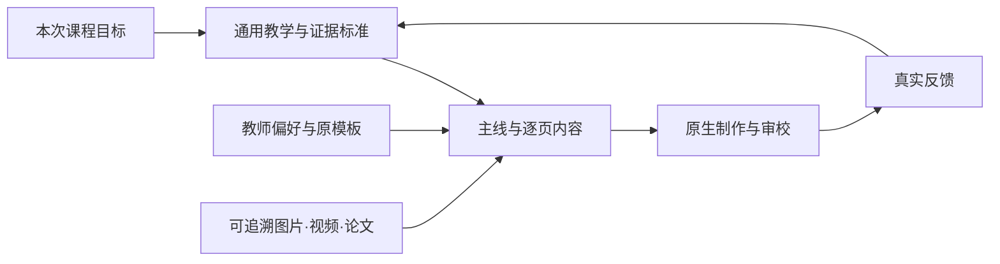

# Academic PPT Craft

**把讲清楚一门课的方法，变成可以共享、复用和持续改进的 skill。**

中文学术教学课件工作流：需求访谈、主线设计、论文证据、LaTeX备课、原生PPT制作与逐页审校。来自教师多轮真实审稿，细到首次术语解释、原模板项目符号、段内红蓝重点、图名压边框、视频时序和删页后的衔接。

[下载完整技能包](https://github.com/zhangzhendan-Berkeley/academic-ppt-craft/releases/latest) · [开始备课](skills/academic-ppt-craft/references/start-prompt.md) · [资源库](docs/resources.md) · [提交问题](https://github.com/zhangzhendan-Berkeley/academic-ppt-craft/issues/new/choose) · [交流想法](https://github.com/zhangzhendan-Berkeley/academic-ppt-craft/discussions)

[12页使用指南：PPT、PDF与完整工程](docs/guide.md)用真实下载录屏、材料分工和反馈示例介绍如何上手。

## 它能帮助完成什么

|已有材料|接下来怎么做|得到什么|
|---|---|---|
|只有课程想法|盘点受众、目标、课时和已有材料，逐轮追问|材料分工清单与课程简报|
|有论文和大纲|梳理认知依赖，确定任务、详略与衔接|可审核的整体主线|
|主线已定|展开原理、图表与研究证据；按授权进入PPT|LaTeX工程或可编辑课件|
|已有PPT，教师提出修改|保留手改，检查全稿同类问题|精修版本、实际验证与修改记录|
|发现新的制作问题|提交样例、限定范围、验证修正|可复用规则与新版本|

它不是自动生成完美课件的承诺，也不是绑定某位教师的万能模板。学术内容仍需专业核验，视觉质量仍需渲染和实际审阅。工具可用性决定是否能联网、转码、生成插画和打开PowerPoint。

## 快速使用

1. 在Releases下载`academic-ppt-craft_v1.3.1.zip`并完整解压，保留skill中的references、assets和scripts。
2. 让agent读取解压目录里的`academic-ppt-craft/SKILL.md`。无需先安装，也能用文件路径启动。
3. 提供课程材料，然后发送下面的提示；详细版在[新课启动Prompt](skills/academic-ppt-craft/references/start-prompt.md)。

```text
请完整读取我提供的 academic-ppt-craft/SKILL.md，再按相关链接学习。
这次课程主题是【主题】，受众是【受众】，时长约【时长】。
先检查现有材料，告诉我哪些需要我补、哪些你可以调研。
每轮只问最影响教学设计的1–3个问题，已有答案不要重复问。
先给内容主线与衔接方案，暂不制作正式PPT。
```

若已安装，在Codex中也可直接使用`$academic-ppt-craft`。想固定到一个项目，可把完整skill目录放进该项目的`.agents/skills/`；客户端发现位置和刷新方式以[OpenAI官方文档](https://learn.chatgpt.com/docs/build-skills)为准。其他agent可直接读取文件，但调用语法和工具能力不一定相同。

已有审核大纲时，直接说“按此大纲完成工程和PPT”；skill不会强迫重做访谈。已有课件时，提供教师实际保存的最新文件。

## 新课要准备什么

- **教师提供**：受众与课时、已学／后续课程边界、希望学生学会什么、授课大纲、指定模板、审美范本、已有改稿、必须讲与不宜讲的内容。
- **共同确定**：贯穿任务、哪些精讲／哪些科普、公式与实验深度、视频播放环境、审阅节点和材料公开范围。
- **agent可调研**：论文与原图、作者演示视频、必要背景、实验对照、清晰插图和来源核验；缺失全文给出可手动下载的清单。

不是开始前必须交齐所有东西。agent先用现有信息工作，只追问会影响下一步的缺口。可填写[课程简报](skills/academic-ppt-craft/assets/course-brief.md)。

## 方法、配置和资源各管什么



通用规则管任务背景、概念、证据、可编辑性和实际审校；[示例配置](skills/academic-ppt-craft/references/preferences.md)提供红蓝科研课堂、WMV和文章页脚等具体起点。换课程可换模板、配色、媒体格式和互动方式，不能把某课七节、120页或50篇论文当作普遍要求。

## 可以直接学习的资源

|资料|范围|用途|
|---|---|---|
|原生PPT模板|15页|字体、层级、编号组合、项目符号、案例与主线版式|
|AI备课SOP|4页PDF|知识依赖、证据抽取与工程流程|
|课程工程范例|128页PDF|连续解释、公式与图表证据|
|图文组合练习|6页PPT|粗框开口图名、角标、侧线和分组|

文件下载和具体阅读位置在[资源库](docs/resources.md)。公开资源逐项登记，不包含保密研究汇报或完整私人课件；附件与内部第三方图像不自动取得本仓库MIT许可。

## 如何一起维护

发现问题用**Issue**提交“实际表现＋期望结果＋匿名化示例＋版本与环境”；尚未定型的想法在**Discussions**讨论；明确修改用**Pull Request**提交。维护者确认适用范围、调整规则与示例、完成检查，再发布**Release**。大家可以提出要求，但一人的偏好不会直接覆盖所有人的配置。

先看[贡献指南](CONTRIBUTING.md)、[维护流程](docs/maintenance.md)与[版本记录](CHANGELOG.md)。不会Git也可在网页填写Issue，不需要先做Fork。

## 目录

```text
skills/academic-ppt-craft/   完整可移植技能包
  SKILL.md                  入口与按任务读取路线
  references/               教学、语言、模板、证据、访谈、审校
  assets/                   已登记的模板、PDF与原生示例
  scripts/                  模板检查、附件核验、打包
docs/                       资源库与协作说明
.github/                    问题表单与PR检查清单
```

脚本辅助检查需Python；模板检查另需`python-pptx`、`lxml`。使用skill文档不要求运行脚本。PowerPoint／WPS、XeLaTeX、视频转码工具按所选任务准备，详见工程规范。

原创方法文档与脚本采用[MIT](LICENSE)；随附教学原件和第三方资料遵循[资源声明](docs/resources.md)各自的使用范围。欢迎补充真正可公开的好例子，让每轮审稿积累成下一门课能用的方法。
