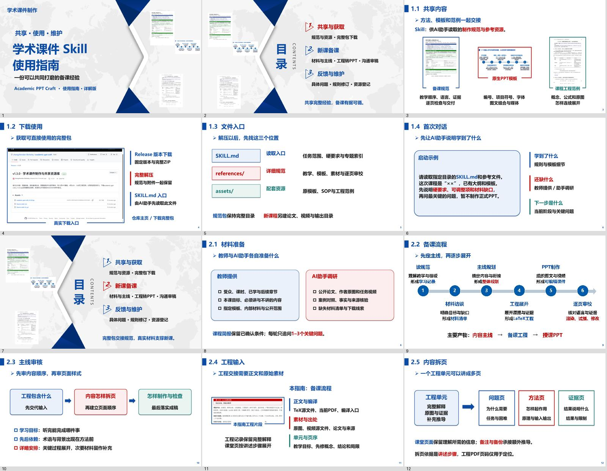
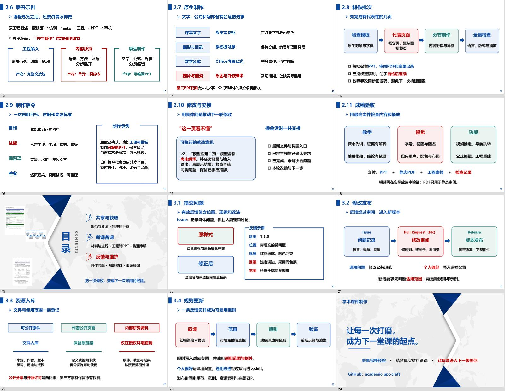

# 24页详解指南

介绍怎样共享、使用和维护这份skill，约15–20分钟。面向第一次接触仓库的教师、学生和研究人员，不要求熟悉Git。

[下载PPT](https://github.com/zhangzhendan-Berkeley/academic-ppt-craft/releases/download/v1.4.0/academic-ppt-craft_guide.pptx) · [静态PDF](https://github.com/zhangzhendan-Berkeley/academic-ppt-craft/releases/download/v1.4.0/academic-ppt-craft_guide.pdf) · [整体主线PDF](https://github.com/zhangzhendan-Berkeley/academic-ppt-craft/releases/download/v1.4.0/academic-ppt-craft_guide_plan.pdf) · [逐页工程PDF](https://github.com/zhangzhendan-Berkeley/academic-ppt-craft/releases/download/v1.4.0/academic-ppt-craft_guide_engineering.pdf) · [完整源包](https://github.com/zhangzhendan-Berkeley/academic-ppt-craft/releases/download/v1.4.0/academic-ppt-craft_guide_source.zip)

## 讲什么

1. **共享与获取**：完整包有哪些规范与附件，怎样从README进入Release下载。
2. **新课备课**：教师和AI助手分别准备什么；工程交接、内容拆页、展开实例、原生对象、制作批次、沟通反馈与最终验收。
3. **反馈与维护**：以配色问题写有效Issue，区分公共规则与个人偏好，再审阅发布、登记资源。

第4页内嵌27.3秒WMV真实浏览器录屏；无播放提示文字。示例录制于首次公共版1.3.0，之后版本的下载流程相同。第20页有意展示红框绿底的反例，演示怎样把抽象“不美观”变成具体可修改的要求。

## 工程与验证

按2页主线、12页LaTeX工程、24页原生PPT的顺序完成。保留原模板目录数字、项目符号、主线箭头与编号圆；正文与示例图形可编辑。

PowerPoint16.0全稿渲染、文字边界与WMV自动播放／进度推进检查通过；WPS12.0全稿静态导出，中文字体与文字内容核对；未测试WPS视频。源文件在独立目录重建，PPT部件内容一致。实际授课前仍按自己的软件环境试播。

原模板、SOP与工程范例按[资源库范围](resources.md)使用；指南不包含保密研究资料。使用说明不是对所有平台兼容或教学质量的无限承诺，欢迎提交具体问题继续改善。

## 可直接使用的沟通示例

[工程转PPT与高效协作](../skills/academic-ppt-craft/references/agent-collaboration.md)附启动学习、主线规划、工程展开、正式制作、修改审稿和换会话交接六类提示。页面展示短版本，源包附完整文档。

原12页内容保留，新增12页安排在相应部分。旧12页版仍可从[v1.3.1历史发布](https://github.com/zhangzhendan-Berkeley/academic-ppt-craft/releases/tag/v1.3.1)下载。
